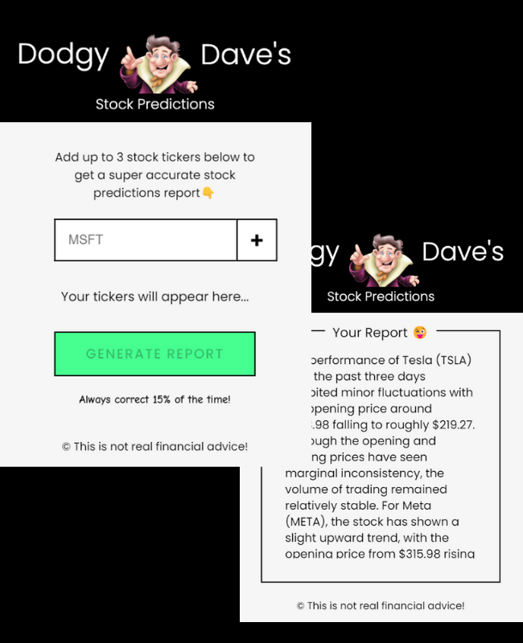

# My AI Apps

This repository serves as a collection of various AI projects. Each project resides in its own dedicated folder. Here's a brief overview of each project:

## [AI Art Generator](./AI%20Art%20Generator)

A tool that uses AI (`DALL-E`) to generate unique pieces of art.

<a href="https://github.com/AbdulDevHub/Simple-AI-Projects/" target="_blank" rel="noreferrer"> 
  
</a>

## [AI Stock App](./AI%20Stock%20App)

An application that uses AI (`ChatGPT`) to predict stock market trends.

<a href="https://github.com/AbdulDevHub/Simple-AI-Projects/" target="_blank" rel="noreferrer"> 
  
</a>

## [AI Translator](./AI%20Translator)

A tool that uses AI (`ChatGPT`) to translate text between different languages.

<a href="https://github.com/AbdulDevHub/Simple-AI-Projects/" target="_blank" rel="noreferrer"> 
  
</a>

## [Colorize Image AI App](./Colorize%20Image%20AI%20App)

An application that uses AI (`Hugging Face`) to colorize black and white images.

<a href="https://github.com/AbdulDevHub/Simple-AI-Projects/" target="_blank" rel="noreferrer"> 
  
</a>

## [Movie Focus Chatbot](./Movie%20Focus%20Chatbot)

A (`ChatGPT`) chatbot that provides information and recommendations about movies.

<a href="https://github.com/AbdulDevHub/Simple-AI-Projects/" target="_blank" rel="noreferrer"> 
  
</a>

## [ReAct AI Agent With Chat UI](./ReAct%20AI%20Agent%20With%20Chat%20UI)

An (`ChatGPT`) AI agent that can interact with users through a chat interface, and execute commands like checking the weather for your location Basically, it can execute pre-defined functions all by itself based on user prompt.

<a href="https://github.com/AbdulDevHub/Simple-AI-Projects/" target="_blank" rel="noreferrer"> 
  
</a>

## [Text To Speech](./Text%20To%20Speech)

A tool that uses AI (`Hugging Face`) to convert text into speech.

<a href="https://github.com/AbdulDevHub/Simple-AI-Projects/" target="_blank" rel="noreferrer"> 
  
</a>

## [Vision AI App](./Vision%20AI%20App)

An application that uses AI (`Hugging Face`) to analyze and interpret images.

<a href="https://github.com/AbdulDevHub/Simple-AI-Projects/" target="_blank" rel="noreferrer"> 
  
</a>

## Quick start

```
$ npm install
$ npm start
````

Feel free to explore each folder for more details about each application. Happy Coding!

<br>
